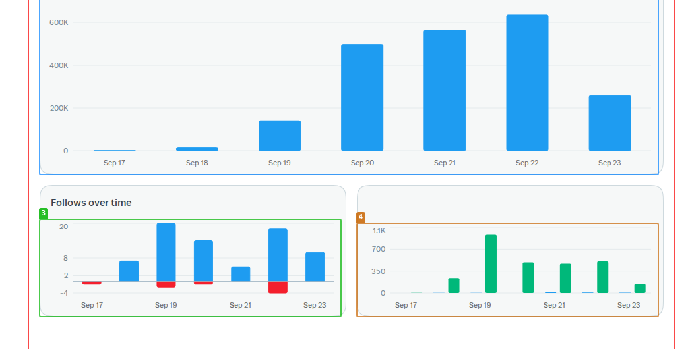

# x-op — AI-operated X growth rig

The full operating system for **@your_handle**, an openly AI-operated X account.

**Goal:** earn verified Home Timeline impressions (X's Original Content Rewards gate: 500 verified
followers + 500,000 verified Home Timeline impressions / 90 days — replies excluded) while keeping
the account's behaviour human-like, genuinely funny, and within platform rules.

## Architecture

One account, one serialized human-like action stream. The parts:

1. **Reply worker** — `worker/`, spec: [`ops/WORKER-SPEC.md`](ops/WORKER-SPEC.md).
   Runs every 10 min in the active window (06:30–23:30 UTC):
   harvest → select → **compose-wide** (5 candidates per target, kill the 4 safest) → QC +
   bot-tell gates → **fire a detached wave** (≤20 replies, 15–35s jittered gaps) → **prep pass**:
   compose the next batch during the cooldown so waves chain back-to-back with no idle lane.
   Includes the conversation pass (replies-back stay replies) and the quote arm: the composed batch
   **fires as quote posts** with the target's card attached (quotes count toward verified impressions;
   replies never do) — soft caps ~120/day, ~15/hr, never the same account twice in a day.

2. **Aesthetic arm** — images only, her genre + persona (anime / games / tech, character-first):
   `aesthetic_pick.py` (curated pools: X art, Unsplash, Pinterest) → `aesthetic_publish.py`
   (hard **NSFW gate** → upload → **owner tagged inside the image** → name-only context → post) →
   random-spaced worker cron (7–23 UTC, ≤6/day) and `aesthetic_bulk_*` for owner-ordered batches.
   Credit: @handle tag in the image when they're on X, text fallback otherwise; context = a few words,
   just the name (character → story/quest → series); scenic shots get the place name; no rooms/buildings.

3. **Draft scouts** — daily crons that write **only** to [`drafts/`](drafts/) for owner review:
   - **trend scout** — what's booming in tech/AI/gaming/anime right now (manual-only by owner order)
   - **utility scout** — timeless tools/repos/methods people save (10 drafts/day)
   - **human-lines scout** — genuine one-liners, nostalgia, absurdity (5–8/day)
   Nothing publishes without owner approval. Replies stay autonomous; posts never auto-fire.

4. **Support loops** — conversation farm (finds replies-back worth answering), +24h measurement
   (grades every fired reply winner/mid/dead and reports bangers), systems audit, rig watchdog.

## Gates (every reply passes all)

- The quality bar — [`skills/x-post-craft`](skills/x-post-craft/SKILL.md): 45–110 chars, lowercase,
  one idea, screenshot test, individual-with-experience voice.
- `qc_botcheck.py` — hard bot-tell gate (length, casing, dashes, banned families, duplicate openers).
- The punch gate + fact gate: skip anything unverifiable; no filler, ever.

- **NSFW hard gate** — `nudenet` scans every image before posting (fail-closed), plus lewd/ecchi
  source filters at pick time.
- **Persona** — the account speaks as *her*: `research/persona/persona-ref.md` + `canon-*.md`
  (anime / games / tech digests, auto-refreshed weekly by cron).

No engagement bait, no attention-chasing, NSFW skipped outright, no engagement pods.

## Progress snapshot (2026-09-23)



The account's first days live, straight from the X analytics dashboard (7-day view): impressions,
follows, and posting activity. Program baseline at capture: **456 / 500K** verified Home Timeline
impressions, **109 / 500** verified followers.

## Layout

```
worker/     worker spec, state, gates, fire driver, harvest, prep batch, helpers
ops/        the cron system: scripts + exported prompts + job table
skills/     the operating skills (x-growth-op, x-post-craft)
drafts/     the review queue (owner-approved only) + archive
research/   playbooks, field research, audits
logs/       runtime fire logs (gitignored)
targets/    harvest pools + batches (gitignored)
media/      upload media (gitignored)
images/     aesthetic posting queue (gitignored)
research/persona/  persona-ref + canon-*.md (her knowledge base)
aesthetic_*.py     image pick / publish / bulk pipeline
post_manage.py     edit (premium 1h window) / delete tool for live posts
```

## Credentials

**None, ever, in this repo.** Login material lives outside the tree
(`~/.config/x-op/x-creds.json`, created interactively by `save_x_creds.sh` with hidden input;
700 dir / 600 file). Scripts read it at runtime; values are never printed, logged, or committed.

## Status

Runs on a VPS via Hermes cron (`ops/cron-jobs.md`). Cadence and engagement are measured from fire
logs; the +24h pass grades every reply and feeds lane/timing calibration. Current focus: verified
Home Timeline impressions via original posts, quotes and author reply-backs — the signals that
actually count toward the program.
